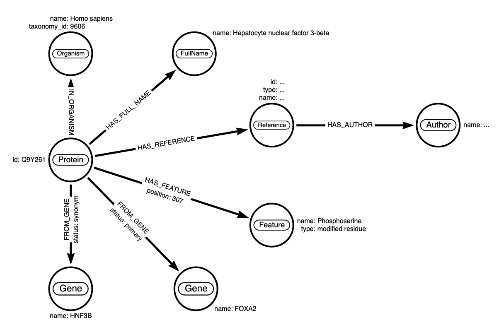
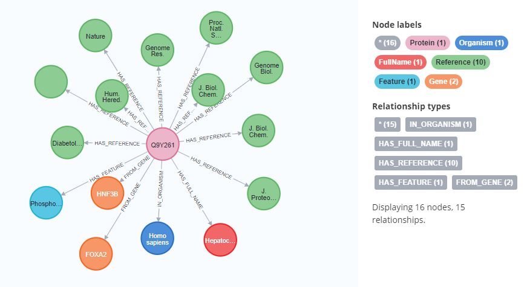
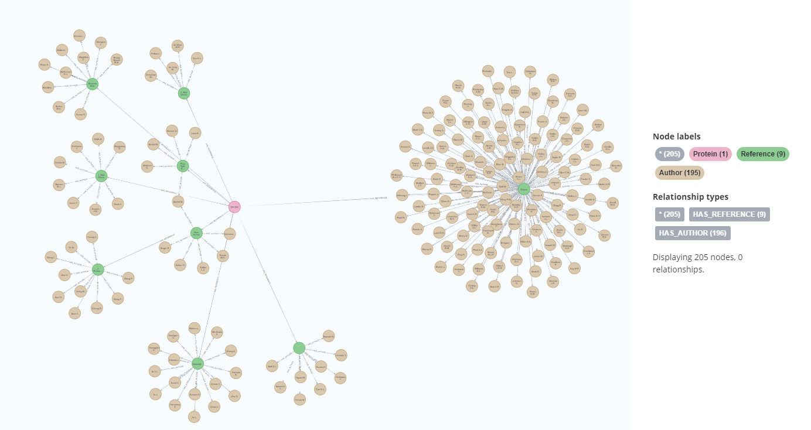

# Import XML to Neo4j

This Python script reads an XML file and creates a node in a Neo4j database. It also generates a relationship between the newly created node and a Protein node.

The script uses the `xmltodict` library to convert the XML file into a Python dictionary and extract the necessary data. It then uses the `neo4j` library to interact with the Neo4j database.

First, the script creates a node in the Neo4j database with the data extracted from the XML file. It then generates a relationship between the newly created node and a Protein node in the database.

## Details

### Schema



### Print 1



```
MATCH (p:Protein)-[]-(n)
RETURN p, n
```

### Print 2



```
MATCH (p:Protein)-[:HAS_REFERENCE]->(r:Reference)-[:HAS_AUTHOR]->(a:Author)
RETURN p, r, a
```
